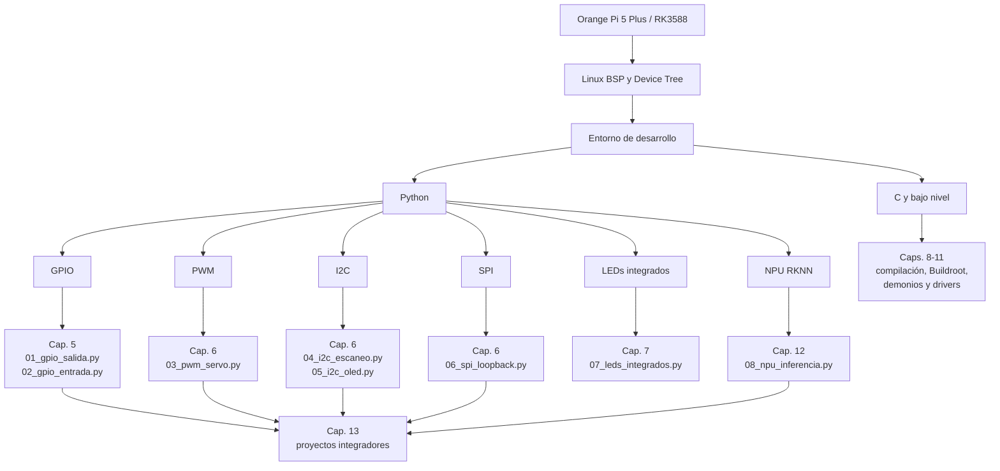

# Orange Pi 5 Plus — Desarrollo de sistemas embebidos con Linux

**Plataforma:** Orange Pi 5 Plus · **SoC:** Rockchip RK3588  
**Sistema operativo:** Ubuntu 22.04.5 LTS · **Kernel:** 5.10.110-rockchip-rk3588 (BSP Rockchip)

## Descripción del proyecto

Este repositorio contiene una serie de módulos de código y documentación técnica para la enseñanza de programación de hardware en sistemas embebidos Linux. Los módulos cubren los principales subsistemas de E/S del SoC RK3588: GPIO, PWM, I2C, SPI, el subsistema LED del kernel y la unidad de procesamiento neuronal (NPU).

Cada módulo Python incluye la fundamentación teórica del subsistema correspondiente, la especificación de las conexiones de hardware y el código documentado. La guía `TUTORIAL.md` desarrolla en detalle la teoría y los procedimientos de cada módulo.

El libro completo del curso está en [`libro/`](libro/). Su índice general se encuentra en [`libro/00_indice.md`](libro/00_indice.md).

## Cómo usar este repositorio

1. Lea primero el índice del libro: [`libro/00_indice.md`](libro/00_indice.md).
2. Prepare la placa con los scripts de configuración inicial.
3. Estudie los capítulos en orden, desde la Parte 1 hasta la Parte 4.
4. Ejecute el script asociado a cada capítulo práctico.
5. Verifique el resultado con el hardware indicado antes de pasar al siguiente módulo.

Ruta recomendada:

| Etapa | Lectura | Práctica |
|---|---|---|
| Fundamentos | [cap01](libro/cap01_presentacion.md) a [cap04](libro/cap04_python.md) | Terminal, Linux y Python |
| GPIO | [cap05_gpio.md](libro/cap05_gpio.md) | [01_gpio_salida.py](01_gpio_salida.py), [02_gpio_entrada.py](02_gpio_entrada.py) |
| Comunicación | [cap06_comunicacion.md](libro/cap06_comunicacion.md) | [03_pwm_servo.py](03_pwm_servo.py), [04_i2c_escaneo.py](04_i2c_escaneo.py), [05_i2c_oled.py](05_i2c_oled.py), [06_spi_loopback.py](06_spi_loopback.py) |
| Integrados | [cap07_integrados.md](libro/cap07_integrados.md) | [07_leds_integrados.py](07_leds_integrados.py) |
| Sistema | [cap08](libro/cap08_compilacion.md) a [cap11](libro/cap11_drivers.md) | Compilación, Buildroot, demonios y drivers |
| NPU y proyectos | [cap12_npu.md](libro/cap12_npu.md), [cap13_proyectos.md](libro/cap13_proyectos.md) | [08_npu_inferencia.py](08_npu_inferencia.py) y proyectos integradores |

Guías validadas en la placa:

| Guía | Uso |
|---|---|
| [Acceso gráfico desde macOS](docs/acceso_grafico_macos.md) | Control remoto de la Orange Pi desde un MacBook con RDP, XRDP, Xvnc y XFCE |
| [Java 25, Maven y Gradle](docs/java25_gradle_maven.md) | Entorno Java moderno probado en RK3588, con comandos para Gradle y Maven |

## Mapa conceptual



## Especificaciones del hardware

| Componente | Especificación |
|---|---|
| SoC | Rockchip RK3588 |
| CPU | 4× Cortex-A76 @ 2.4 GHz + 4× Cortex-A55 @ 1.8 GHz |
| RAM | 16 GB LPDDR4X |
| GPU | Mali-G610 MP4 — OpenGL ES 3.1 / OpenGL 3.0 (driver Panfrost) |
| NPU | 6 TOPS — 3 núcleos × 2 TOPS (driver RKNPU) |
| Ethernet | 2× 2.5 GbE (Realtek RTL8125BG) |
| WiFi | IEEE 802.11 a/b/g/n/ac (AP6275P) |
| GPIO | Cabecero de 40 pines (pinout compatible con Raspberry Pi) |

## Configuración inicial del sistema

Los siguientes scripts configuran el sistema operativo para el acceso a los periféricos sin privilegios de superusuario. Se ejecutan una única vez tras la instalación del sistema operativo.

```bash
./setup_gpio_permissions.sh   # Grupos, reglas udev, overlay PWM, servicio systemd
./setup_npu.sh                # Runtime RKNN (rknn-toolkit-lite2 + librknnrt.so)
sudo reboot
```

Tras el reinicio, todos los módulos de este repositorio funcionan sin `sudo`.

## Dependencias Python

```bash
pip3 install gpiod smbus2 spidev luma.oled opencv-python numpy
```

## Estructura del repositorio

| Archivo | Subsistema | Descripción |
|---|---|---|
| [setup_gpio_permissions.sh](setup_gpio_permissions.sh) | Sistema | Permisos de GPIO, I2C, SPI, PWM y LEDs |
| [setup_npu.sh](setup_npu.sh) | Sistema | Instalación del runtime RKNN |
| [01_gpio_salida.py](01_gpio_salida.py) | GPIO | Control de salida digital mediante libgpiod v2 |
| [02_gpio_entrada.py](02_gpio_entrada.py) | GPIO | Lectura de entrada digital con detección de flancos |
| [03_pwm_servo.py](03_pwm_servo.py) | PWM | Control de servomotor mediante PWM por hardware |
| [04_i2c_escaneo.py](04_i2c_escaneo.py) | I2C | Enumeración de dispositivos en el bus I2C |
| [05_i2c_oled.py](05_i2c_oled.py) | I2C | Control de pantalla OLED SSD1306 (128x64) |
| [06_spi_loopback.py](06_spi_loopback.py) | SPI | Verificación del bus SPI mediante loopback |
| [07_leds_integrados.py](07_leds_integrados.py) | LED | Control de LEDs de la placa mediante sysfs |
| [08_npu_inferencia.py](08_npu_inferencia.py) | NPU | Clasificación de imágenes con ResNet-18 en el NPU |
| [TUTORIAL.md](TUTORIAL.md) | Documentación | Guía académica completa con teoría y procedimientos |

## Problemas conocidos del BSP

| Síntoma | Causa raíz | Solución |
|---|---|---|
| Mensajes `RKNPU: can't request region` en dmesg | Defecto del árbol BSP 5.10 | Sin impacto funcional; el NPU opera correctamente |
| Acceso denegado a `/dev/gpiochipN`, `/dev/i2c-*`, `/dev/spidev*` | El usuario no pertenece a los grupos `gpio`, `i2c` y `spi` | `setup_gpio_permissions.sh` |
